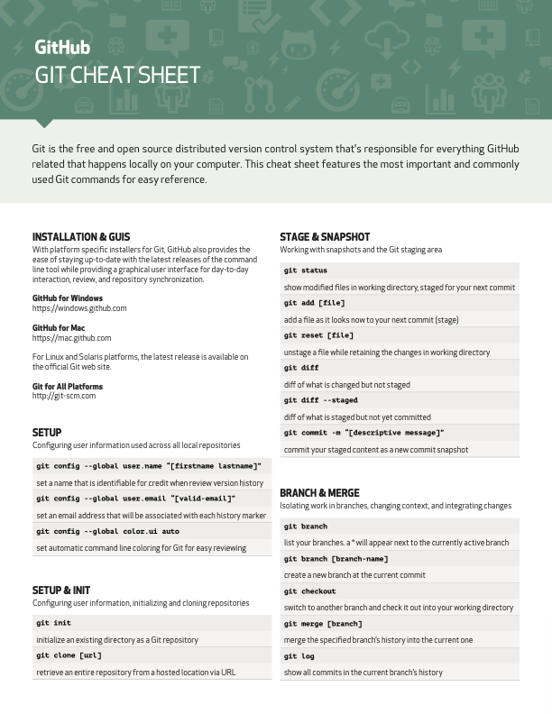
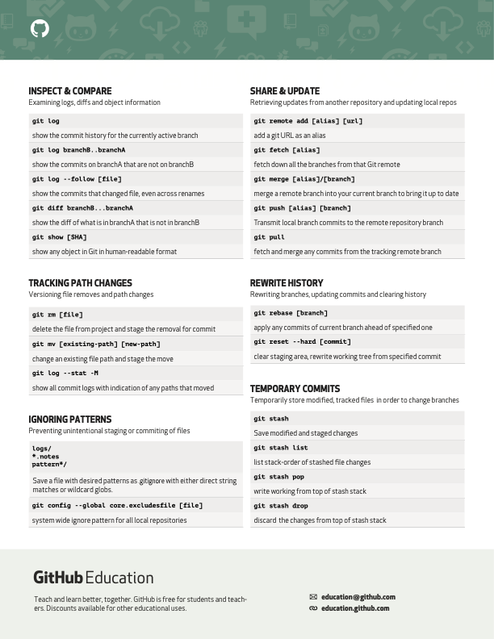

# Kodlıuyoruz Ilk Repo

Bu repo [www.kodluyoruz.org](Kodluyoruz) Front-End Eğitiminde oluşturduğumuz ilk repo. İçerisinde bir adet README dosyası, bir adet de index.html barındırıyor.

## Git Cheat Sheet

## Installation

Öncelikle projeyi clonelayın. [https://github.com/mzyavuz/kodluyoruzilkrepo.git](https://github.com/mzyavuz/kodluyoruzilkrepo.git)

' git clone https://github.com/mzyavuz/kodluyoruzilkrepo.git '

## Usage

Projeyi cloneladıktan sonra Visual Studio Code programında açınız.

Linux için:

'''
cd kodluyoruzilkrepo
code .
'''

## Contributing

Pull requestler kabul edilir. Büyük değişiklikler için, lütfen önce neyi değiştirmek istediğinizi tarrtışmak için bir konu açınız.

## License

[https://opensource.org/licenses/MIT](MIT)